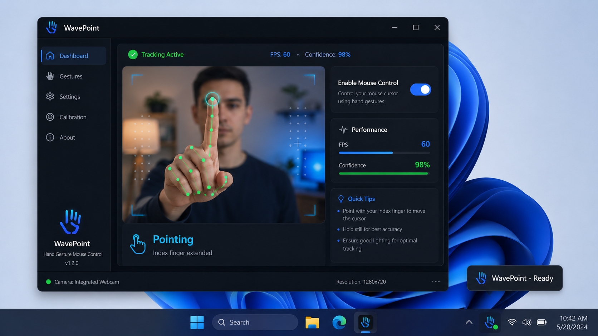

# WavePoint



WavePoint is a Windows app for controlling your mouse cursor with hand movements from a webcam. It combines a Python UI with a C++ gesture engine for low-latency cursor control, safety checks, and offline processing.

## What It Does

- Moves the cursor from your index finger position
- Supports pinch gestures for clicks
- Supports drag, scroll, and pause states
- Starts in Test Mode so you can verify tracking before enabling control
- Stores settings locally in your Windows profile

## Why WavePoint

- Safety first: uncertain detections do nothing
- Private by design: no cloud, no telemetry, no video storage
- Built for Windows: optimized for local desktop use
- Fast response: Python for UI, C++ for gesture processing

## Requirements

- Windows 10 or 11, 64-bit
- Python 3.9 or newer
- Webcam with at least 720p support
- Visual Studio 2019/2022 with C++ workload if you want the native core
- CMake 3.20+ and pybind11 for the C++ build

## Install

### Quick setup

```batch
scripts\setup.bat
```

This creates the virtual environment and installs the Python dependencies.

### Run the app

```batch
scripts\run.bat
```

### Optional native build

```batch
scripts\build.bat
```

This builds the C++ gesture engine for better performance.

## How To Use

### 1. Start WavePoint

Run `scripts\run.bat` or launch the app from your installed environment.

### 2. Stay in Test Mode first

WavePoint opens in Test Mode by default. Use it to check:

- Whether your hand is being detected
- Whether the camera image is stable and bright enough
- Whether the confidence score stays high enough
- Whether gestures are recognized correctly before enabling control

### 3. Calibrate

Open the Calibration dialog and follow the on-screen markers.

- Point at each marker with your index finger
- Hold steady until the step completes
- Finish all markers before using live cursor control

### 4. Enable mouse control

After testing and calibration, turn on control from the main window or the tray icon.

### 5. Use the gestures

| Gesture | Result |
| --- | --- |
| Index finger pointing | Move cursor |
| Thumb + index pinch | Left click |
| Thumb + middle pinch | Right click |
| Two fingers vertical motion | Scroll |
| Closed fist | Drag |
| Open palm | Neutral / pause |
| Hand removed | Auto pause |

## App Flow

1. Launch the app
2. Check tracking in Test Mode
3. Calibrate for your screen
4. Enable control
5. Use the tray icon for quick access to settings, test mode, and exit

## Settings Storage

WavePoint saves configuration here:

```text
%APPDATA%\WavePoint\
├── config.json
└── profiles\
```

## Project Layout

```text
WavePoint/
├── src/
│   ├── cpp/                # Native gesture engine
│   └── gesture_mouse/      # Python app, UI, tracker, and settings
├── scripts/                # Windows setup, build, and run scripts
├── docs/                   # Architecture and safety documentation
├── requirements.txt        # Python dependencies
├── pyproject.toml          # Packaging metadata
└── LICENSE                 # MIT license
```

## Documentation

- [Architecture Details](docs/ARCHITECTURE.md) - how the Python and C++ parts fit together
- [Safety Documentation](docs/SAFETY.md) - fail-safe behavior and gesture safeguards

## Troubleshooting

### No hand detected

- Use brighter, even lighting
- Keep your hand fully inside the camera frame
- Avoid sitting with a bright window behind you

### Cursor feels jumpy

- Re-run calibration
- Lower cursor speed or increase smoothing in settings
- Improve lighting and camera stability

### Gestures are unreliable

- Stay in Test Mode until the confidence score is steady
- Make the gesture clearly and hold it briefly
- Check that the camera sees the hand from the side you expect

## License

This project is licensed under the MIT License. See [LICENSE](LICENSE).

## Acknowledgments

- [MediaPipe](https://mediapipe.dev/) - hand landmark detection
- [OpenCV](https://opencv.org/) - camera processing
- [PyQt6](https://www.riverbankcomputing.com/software/pyqt/) - desktop UI
- [pybind11](https://pybind11.readthedocs.io/) - Python/C++ bridge
